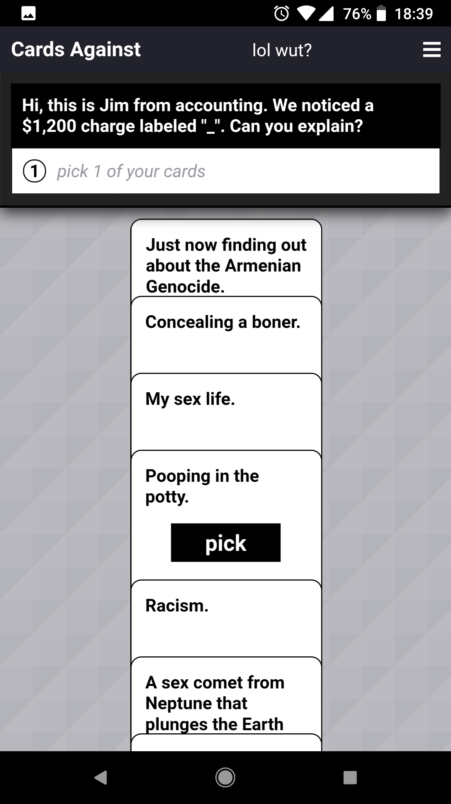
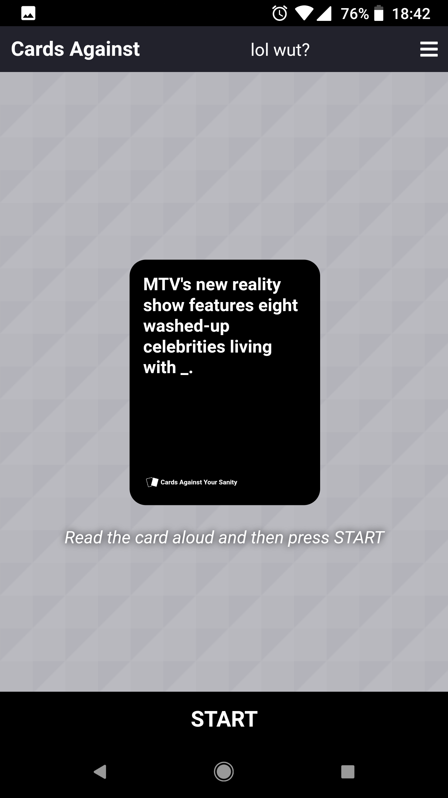
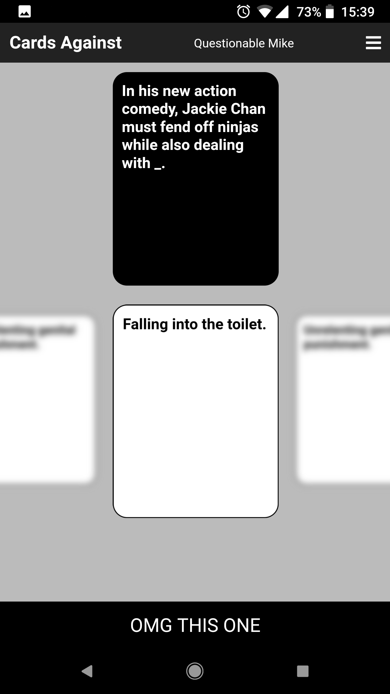
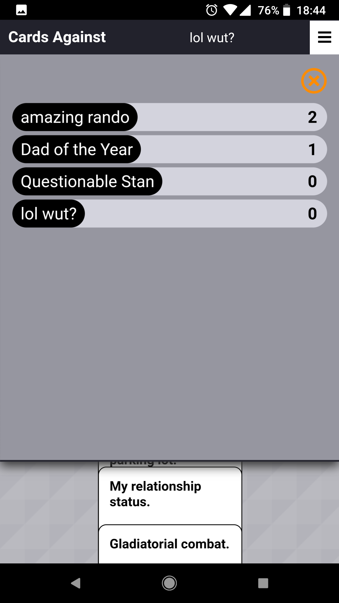
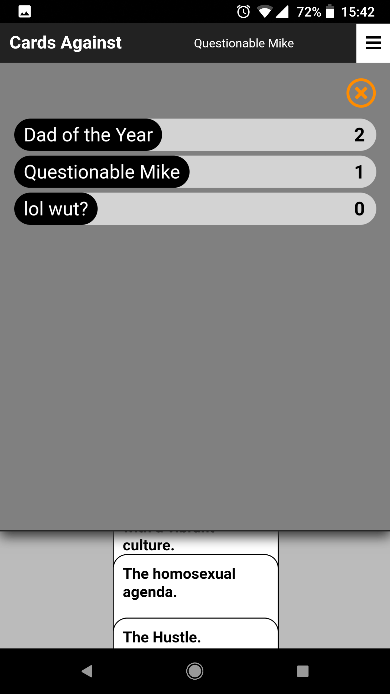
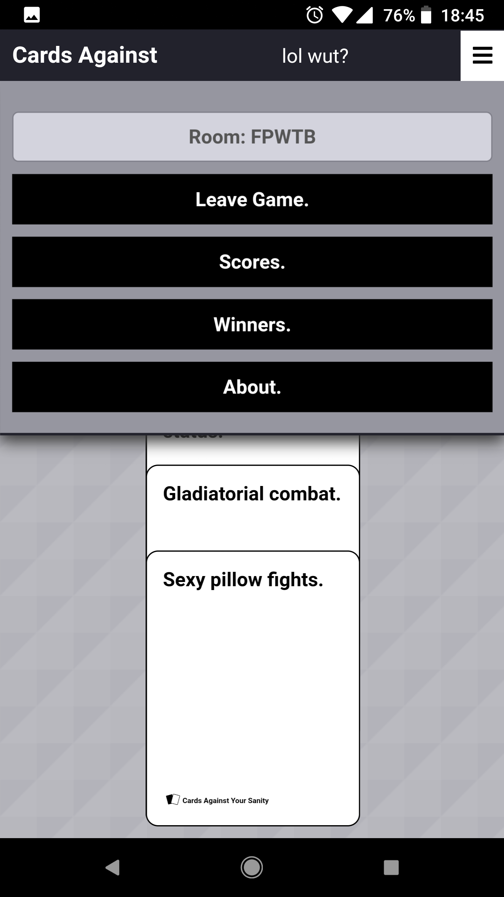

Playable here:
https://cardsagainstyoursanity.herokuapp.com/

# Cards Against Your Sanity

### A party web app for horrible people by Ryan Edwards and Philip Zak

## What is Cards Against Your Sanity?

Cards Against Your Sanity is a multiplayer web app game based on the popular party card game Cards Against Humanity.

What is Cards Against Humanity? From their website:

> Cards Against Humanity is a party game for horrible people. Unlike most of the party games you've played before, Cards Against Humanity is as despicable and awkward as you and your friends.
>The game is simple. Each round, one player asks a question from a black card, and everyone else answers with their funniest white card.

It is intended to be played in a party environment where everybody is in the same room, so that all can marvel at the depths of each others depravity without hiding behind the comforting mask of anonymity.

## OK but why tho?

Unless you're the type of person who always carries around a box of Cards Against Humanity (in which case... really? wow.), you'll no doubt end up in a situation, often involving friends and alcohol, that would be the perfect recipe for reprehensible humor, but alas, you forgot to plan for such debauchery!

Now you don't have to. https://cardsagainstyoursanity.herokuapp.com/

## Screenshots

## Technology

CAYS is built using React.js and Socket.IO, on a very light Node.js backend. The actual card JSON data was sourced from http://www.crhallberg.com/cah/, and includes all of the base cards and official expansions 1-6 and the Green Box Expansion.